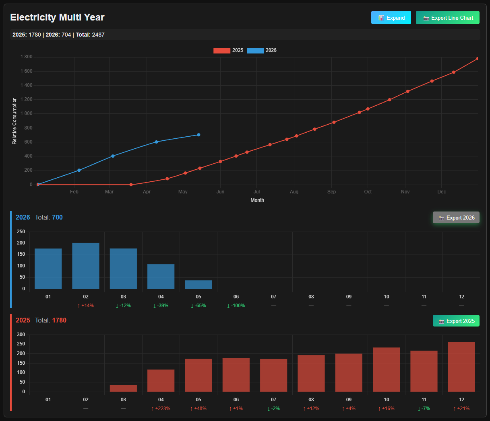
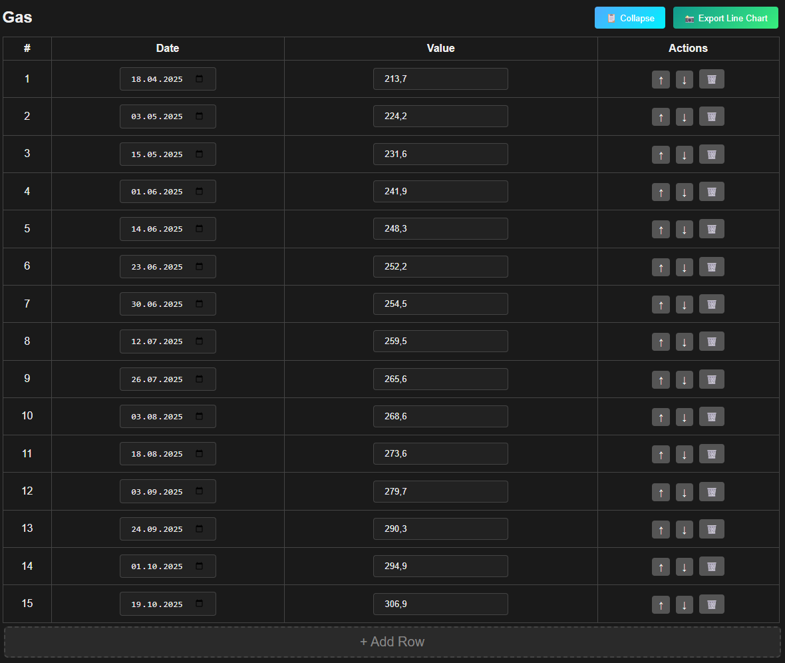

<div align="center">
  <h3 align="center">Tracker</h3>

  <p align="center">
    A minimal, browser-only, single-page tracker for meter/consumption readings.
    <br />
    Add categories → enter dated readings → see yearly overlays + monthly bar breakdowns.
    <br /><br />
    <a href="https://kamelotmarmot.github.io/ReadingsTracker/"><strong>View Demo »</strong></a>
    ·
    <a href="https://github.com/KaMeLoTmArMoT/ReadingsTracker/issues">Report Bug</a>
    ·
    <a href="https://github.com/KaMeLoTmArMoT/ReadingsTracker/issues">Request Feature</a>
  </p>
</div>

## About The Project

Tracker is a tiny browser-only dashboard for tracking consumption-like counters (gas, electricity, water, etc.) over time.
It’s designed to stay simple: CSV in/out, quick edits, and clear charts per category.

<p align="center">
   
</p>

### Key Features

- Multiple categories (each category has its own table + charts).
- Date/value readings with row reorder, delete, and quick add.
- Line chart: yearly overlay (normalized to compare years).
- Bar charts: monthly totals per year (always months 01–12, zeros if missing).
- PNG export for charts (line chart + per-year bar charts).
- CSV import/export.
- Backward-compatible CSV import (old “category,date,value” still loads).

### Built With

- Vanilla JavaScript (no build step).
- HTML + CSS.
- Chart.js (via CDN).

## Getting Started

### Prerequisites

- A modern browser (Chrome/Firefox/Safari).
- CSV exported as UTF‑8 (recommended).

### Installation

1. Clone the repo:
   ```bash
   git clone https://github.com/KaMeLoTmArMoT/ReadingsTracker.git
   cd ReadingsTracker
   ```

2. Run a local static server (recommended):
   ```bash
   python3 -m http.server 8000 --bind 0.0.0.0
   ```

3. Open in browser:
   - Desktop: http://localhost:8000/
   - Phone (same Wi‑Fi): http://<YOUR_PC_LAN_IP>:8000/

## Usage

1. Open the app (local).
2. Add a category (e.g., “Gas”).
3. Add rows and enter readings (date + value).

<p align="center">
   
</p>

4. Use Export CSV / Import CSV to save/restore.
5. Use “Export Line Chart” / “Export YYYY” to download PNG images.

### CSV Format

**New format (recommended):**
```csv
category,date,value,cost_per_unit,currency,unit
gas,2025-01-01,100,0.20,EUR,m3
gas,2025-02-01,120,0.20,EUR,m3
```

**Legacy format (supported for import):**
```csv
category,date,value
gas,2025-01-01,100
gas,2025-02-01,120
```

### Sample CSV

- [Electricity_Multi_Year](examples/electricity_multi_year.csv)

Headers:
`category | date | value`

## Roadmap

- Auto-save/load to localStorage.
- Average daily/monthly consumption stats.
- Rate periods (time ranges) + correct cost splitting across rate changes.
- Better import UX (drag & drop zone, preview).

See the [open issues](https://github.com/KaMeLoTmArMoT/ReadingsTracker/issues).

## Contributing

Contributions are welcome:
1. Fork the repo
2. Create a feature branch
3. Open a PR

For bug reports, please include:
- Device + browser
- Steps to reproduce
- A small CSV sample (or screenshot)

## License

This project is licensed under the MIT License — see [`LICENSE`](https://github.com/KaMeLoTmArMoT/ReadingsTracker/blob/master/LICENSE).

## Acknowledgments

- README structure inspired by Best-README-Template.
- Built with assistance from generative AI tools for ideation and code suggestions; all changes were reviewed and tested by the author.
